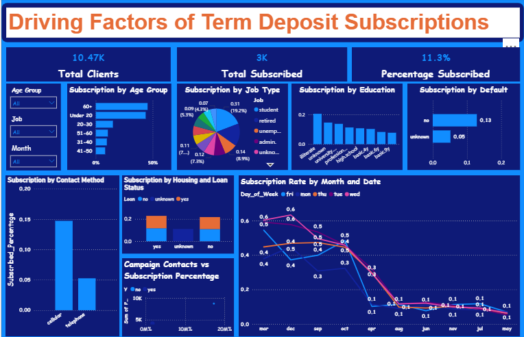

**# Drivers_of_Term_Deposit_Subscription**

**Dataset Description:**
This is a dashboard analysis identifying key factors influencing term deposit subscriptions using Power BI. This dataset originates from direct marketing campaigns conducted by a Portuguese banking institution. The campaigns primarily involved telephone outreach, often requiring multiple calls to the same client to determine whether they would subscribe ("yes") or decline ("no") a term deposit product.

**Project Overview:**
This dashboard explores the key factors influencing whether customers subscribe to term deposits at the Portuguese banking institution. It leverages demographic, behavioral, and campaign-related data to help decision-makers understand what drives successful marketing outcomes. By visualizing the data interactively, it enables business leaders to target the right segments more effectively and optimize their campaign strategies.

**Dashboard Insights:**
The dashboard features real-time visuals showing how age, job type, education, loan status, and contact method relate to subscription success. With dynamic filters for age group, job, and campaign month, users can dive deep into patterns such as students and retirees having higher subscription rates, or cellular calls performing better than telephone outreach. Trends across months and days of the week help in timing campaigns for maximum impact.

**Purpose & Value:**
By making complex data easy to interpret, this dashboard empowers marketers, analysts, and bank executives to make informed, data-backed decisions. Instead of relying on guesswork, they can now focus efforts where the likelihood of success is highest, boosting efficiency, customer conversion, and overall ROI on marketing efforts. It’s a powerful example of how data storytelling can guide strategy in the finance sector.

## 📸 Visuals & Explanations

### 1. Dashboard Overview

This dashboard provides a detailed visual exploration of factors influencing term deposit subscriptions among 10,476 Portuguese clients, with 3,000 already subscribed, representing an 11.3% conversion rate. Notably, individuals aged 60+ and those under 20 have the highest subscription rates—each exceeding 40%—suggesting a blend of retirement planning and early financial education. The middle-age groups, especially 31–60, show lower engagement, presenting an opportunity for targeted campaigns. Job type data reveals that students, retirees, and blue-collar workers are most responsive, indicating diverse participation across societal roles. Cellular contact stands out as the most effective communication method, and financial trustworthiness—measured by the absence of default history—correlates strongly with subscription success.

Education level, housing, and loan status show mixed influence, with no significant trend across those variables, though campaign contact does offer a slight boost in subscriptions. Seasonal and weekday trends are also critical: subscriptions peak in July and are stronger on Mondays and Fridays, suggesting strategic timing can improve outcomes. Overall, this dashboard suggests the need for data-driven outreach—particularly via mobile—combined with trust-building and timely engagement. By tailoring strategies to audience behavior and life stage, the bank can expand participation in term deposits and foster a culture of saving across all demographics.

---

### 2. Subscription by Age Group

The chart on subscription by age group reveals that both the elderly (60+) and the very young (under 20) are the most likely to subscribe to term deposits, each with subscription rates nearing 45–50%. For older adults, this trend is expected due to their focus on retirement and stable income sources like pensions. The high rate among younger individuals is more surprising and may be influenced by parental guidance or account management, or possibly a small sample size tilting the results.

On the other hand, subscription rates decline steadily among the 20–50 age range, hitting a low point between 41–50—likely due to financial pressures like housing, family responsibilities, or career instability. Rates begin to rise again for the 51–60 group as they approach retirement. These trends suggest the need for targeted financial messaging: emphasize stability and long-term planning for older adults, and explore what’s working for the youth to re-engage the middle-aged Portuguese population more effectively.

---

### 3. Subscription by Education Level

The subscription by education analysis of this Portuguese dataset reveals an unexpected trend which is that less formally educated individuals, including the illiterate, have the highest subscription rates with over 20%. This may stem from a higher level of trust in advice from bank personnel or a simpler, more straightforward approach to financial decision-making. In contrast, University graduates and those with unknown education levels show lower rates (around 14–15%), possibly due to more skepticism or vested interest in alternative investment options beyond term deposits.

Mid-level education groups, such as those with high school or professional courses, perform moderately (10–12%), while basic education levels (4y, 6y, 9y) show the lowest engagement. **This pattern challenges the assumption that higher education leads to higher financial participation.** The recommendation is clear: do not rely solely on academic background as a predictor of financial behavior. Instead, customize marketing approaches by using relatable, benefit-driven messaging for less-educated groups and a smarter or more strategic messaging for educated customers.

---

### 4. Subscription by Contact Method

The chart comparing contact methods shows a striking difference in effectiveness: cellular contact results in a 15% subscription rate, while traditional telephone contact lags behind at just 5%. This suggests that the Portuguese are far more responsive when reached on their mobile devices, likely because of the convenience and personal nature of mobile communication. The visual design reinforces this contrast, using bold bars to highlight cellular's dominance.

The key takeaway is clear: mobile outreach is the winning strategy. Banks and marketers should prioritize SMS campaigns, app notifications, or direct mobile calls. Staff should also be trained to communicate in a concise, approachable manner suited for mobile users. Understanding why telephone outreach underperforms—whether due to timing, tone, or user preference—could further improve engagement strategies. In today’s fast-paced world, meeting clients on their preferred platforms is essential to boosting subscription rates.
---

### 5. Campaign Contact Attempts vs Subscription

Here we see a rising trend: more contact attempts generally lead to more subscriptions—but with diminishing returns. A balance between persistence and customer fatigue is crucial.

---

### 6. Subscription Rate by Month and Day

The subscription rate is highest in **March and May**, with noticeable drops from **August onward**. Tuesdays and Thursdays see slightly better conversion than other weekdays—ideal for campaign timing.

